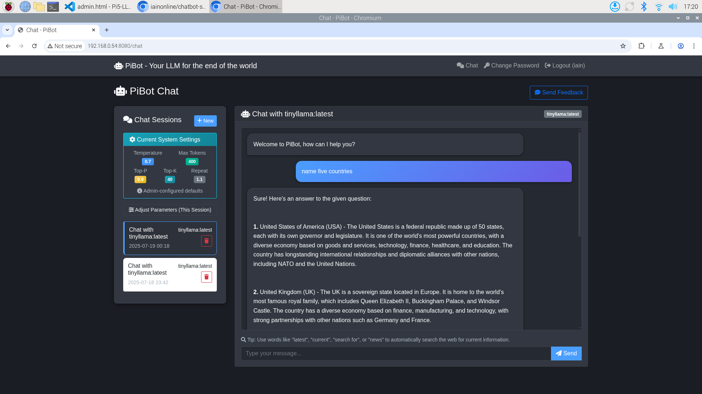

# 🤖 PiBot - Ollama Chatbot Server for Raspberry Pi 5

[](https://opensource.org/licenses/MIT)
[](https://www.python.org/downloads/)
[](https://www.raspberrypi.org/)

A powerful, self-hosted web-based chatbot application that runs locally on Raspberry Pi 5 using Ollama LLM models. Experience the power of local AI with real-time streaming responses, user authentication, persistent chat history, and comprehensive admin tools.

## 📸 Interface Preview


*PiBot's sleek dark theme interface showing real-time chat with tinyllama model, featuring system settings sidebar, streaming responses, and professional UI design.*

## ✨ Key Features

## ✨ Key Features

### 🚀 **Local AI Power**
- **Privacy-first**: All AI processing happens locally on your Pi
- **No cloud dependencies**: Complete control over your data
- **Real-time streaming**: See responses as they're generated
- **Multiple models**: Support for Llama2, Mistral, Phi, CodeLlama, and more
- **LED status indicators**: Visual system status on Pi5 front LEDs

### 💡 **Intelligent LED Status System**
- **Real-time monitoring**: Front LEDs show system health at a glance
- **Multiple status patterns**: Network, server, and combined issue indicators
- **Heartbeat monitoring**: Green LED pulses every 10 seconds when healthy
- **Auto-startup integration**: LEDs indicate boot progress and system state

### 💬 **Advanced Chat Experience**
- **Session management**: Create, resume, and organize chat sessions
- **Real-time performance metrics**: Token/sec, response times, and more
- **Parameter tuning**: Adjust temperature, top-p, top-k, and more per session
- **Web search integration**: Automatic web search for current information

### 👥 **Multi-User Support**
- **Secure authentication**: User registration and login system
- **Individual chat history**: Each user has their own private conversations
- **Remember me**: Optional persistent login sessions
- **Admin dashboard**: Comprehensive management and analytics

### 📊 **Analytics & Monitoring**
- **Usage statistics**: Track model performance and user engagement
- **Rating system**: 5-star feedback for continuous improvement
- **Data export**: JSON export for analysis and backup
- **System monitoring**: Real-time Ollama service status
- **Admin-only server status**: Comprehensive system monitoring dashboard
- **Resource tracking**: CPU, memory, disk usage with real-time updates
- **Network information**: Local, network, and external access URLs

### 🔐 **Enterprise-Ready Security**
- **Encrypted passwords**: bcrypt hashing for user authentication
- **Session management**: Secure token-based sessions
- **Admin controls**: Protected administrative functions with privilege checks
- **CSRF protection**: Built-in security measures
- **Status monitoring**: Admin-restricted server status and system information

## Tech Stack

- **Backend**: Python Flask with Socket.IO for real-time communication
- **Database**: SQLAlchemy with SQLite (easily upgradeable to PostgreSQL)
- **Frontend**: Bootstrap 5 with vanilla JavaScript
- **Authentication**: Flask-Login with bcrypt password hashing
- **Production Server**: Gunicorn with Eventlet workers
- **AI Backend**: Ollama running locally
- **LED Control**: Raspberry Pi 5 GPIO LED management with real-time status monitoring

## LED Status Indicators

PiBot features a comprehensive LED status system that provides visual feedback about system health:

| LED Pattern | Status | Description |
|-------------|--------|-------------|
| ⚡ **Fast Blinking Yellow** | Initializing | System starting up |
| 🔴 **Solid Red** | No Network | Internet connection lost |
| 🟡 **Slow Blinking Yellow** | Server Down | PiBot service not running |
| 🔴🟡 **Alternating Red/Yellow** | Both Issues | Network + Server problems |
| 🟢 **Solid Green** | All Systems Running | Everything operational |
| 🟢💓 **Green with Heartbeat** | Healthy Operation | 9.5s on, 0.5s off pulse |
| 🔵 **All LEDs Off** | Shutdown | System powered down |

The LED system automatically monitors:
- Network connectivity (ping to multiple DNS servers)
- PiBot service status (systemd + web server response)
- Continuous health checks with visual heartbeat

## Installation

### Prerequisites

1. **Raspberry Pi 5** with Raspberry Pi OS
2. **Python 3.8+**
3. **Ollama** installed and running

### Step 1: Install Ollama

```bash
# Install Ollama
curl -fsSL https://ollama.ai/install.sh | sh

# Start Ollama service
ollama serve

# Pull some models (in a new terminal)
ollama pull llama2
ollama pull mistral
ollama pull phi
```

### Step 2: Clone and Setup the Application

```bash
# Navigate to the project directory
cd /home/iain/Pi5-LLM

# Create a virtual environment
python3 -m venv venv
source venv/bin/activate

# Install dependencies
pip install -r requirements.txt

# Set up environment variables
cp .env .env.local
# Edit .env.local with your configurations
```

### Step 3: Configure Environment

Edit `.env` file with your settings:

```bash
SECRET_KEY=your-super-secret-key-change-this-in-production
DATABASE_URL=sqlite:///chatbot.db
OLLAMA_URL=http://localhost:11434
FLASK_ENV=production
GUNICORN_WORKERS=2
GUNICORN_BIND=0.0.0.0:8080
```

### Step 4: Initialize Database

```bash
# Activate virtual environment
source venv/bin/activate

# Initialize database (this will create admin user)
python app.py
```

The system will create a default admin user:
- **Username**: admin
- **Password**: admin123
- **Important**: Change this password after first login!

### Step 5: Start the Server

#### Development Mode
```bash
python app.py
```

#### Production Mode (Recommended)
```bash
# Use the startup script
./start_server.sh

# Or manually with Gunicorn
gunicorn --config gunicorn.conf.py app:app
```

#### Auto-Startup Configuration
For automatic startup on boot:

```bash
# Install systemd services
sudo cp ollama-chatbot.service /etc/systemd/system/
sudo cp pibot-status-monitor.service /etc/systemd/system/
sudo systemctl daemon-reload
sudo systemctl enable ollama-chatbot pibot-status-monitor

# Configure desktop auto-launch
mkdir -p ~/.config/autostart
cp pibot-browser.desktop ~/.config/autostart/

# Make scripts executable
chmod +x launch_pibot.sh led_control.sh pibot_status_monitor.sh
```

The server will be available at `http://your-pi-ip:8080`

**LED Status**: Watch the front LEDs for system status - green means everything is working!

## Usage

### LED Status Monitoring

PiBot automatically displays system status through the Pi5's front LEDs:

```bash
# View LED status table
./pibot_status_monitor.sh --table-only

# Manual LED control
sudo ./led_control.sh pibot [status]
sudo ./led_control.sh control [PWR|ACT] [on|off|blink]

# Service management
sudo systemctl start/stop pibot-status-monitor
```

### For Users

1. **Register/Login**: Create an account or login with existing credentials
2. **Monitor Status**: Check the front LEDs - green means all systems operational
3. **Start Chatting**: 
   - Select a model from the dropdown
   - Create a new session or resume an existing one
   - Type your message and press Enter or click Send
4. **Rate Responses**: Click the "Rate" button after receiving a response
5. **Manage Sessions**: View and switch between your chat sessions in the sidebar

### For Administrators

1. **Access Admin Panel**: Login with admin credentials and click "Admin" in the navigation
2. **Monitor System**: Watch LED indicators for real-time system health
3. **View Statistics**: Monitor user activity, model usage, and performance metrics
4. **Export Data**: Download chat data or user statistics for analysis
5. **System Monitoring**: Check Ollama service status and system health
6. **LED Management**: Control status indicators manually if needed

## Configuration

### Environment Variables

| Variable | Description | Default |
|----------|-------------|---------|
| `SECRET_KEY` | Flask secret key for sessions | `your-secret-key-change-this` |
| `DATABASE_URL` | Database connection string | `sqlite:///chatbot.db` |
| `OLLAMA_URL` | Ollama API endpoint | `http://localhost:11434` |
| `GUNICORN_WORKERS` | Number of Gunicorn workers | `1` (optimized for Pi5) |
| `GUNICORN_BIND` | Server bind address | `0.0.0.0:8080` |

### LED Control Commands

```bash
# Status patterns
sudo ./led_control.sh pibot initializing    # Fast yellow blink
sudo ./led_control.sh pibot no_network      # Solid red
sudo ./led_control.sh pibot server_down     # Slow yellow blink
sudo ./led_control.sh pibot both_issues     # Alternating red/yellow
sudo ./led_control.sh pibot running         # Solid green
sudo ./led_control.sh pibot running_heartbeat # Green with pulse

# Manual LED control
sudo ./led_control.sh control PWR on        # Power LED on
sudo ./led_control.sh control ACT blink     # Activity LED blink
sudo ./led_control.sh list                  # List available LEDs
```

### Adding New Models

To add new Ollama models:

1. Pull the model: `ollama pull model-name`
2. Add the model name to `AVAILABLE_MODELS` list in `app.py`
3. Restart the server

## Auto-Startup Configuration

PiBot includes comprehensive auto-startup functionality that makes your Pi5 a true plug-and-play AI device.

### What Happens at Boot

1. **System Boot** → Raspberry Pi 5 starts up
2. **Service Start** → systemd automatically starts `ollama-chatbot` service
3. **LED Monitor** → `pibot-status-monitor` service begins visual status monitoring
4. **Desktop Load** → User desktop environment initializes
5. **Auto-Launch** → Desktop autostart runs `launch_pibot.sh`
6. **Browser Open** → Chromium opens to PiBot login page automatically
7. **Status Monitoring** → LEDs continuously show system health

### Setup Commands

```bash
# Install and enable services
sudo cp ollama-chatbot.service pibot-status-monitor.service /etc/systemd/system/
sudo systemctl daemon-reload
sudo systemctl enable ollama-chatbot pibot-status-monitor

# Configure desktop auto-launch
mkdir -p ~/.config/autostart
cp pibot-browser.desktop ~/.config/autostart/

# Make all scripts executable
chmod +x *.sh

# Test the setup
./final_verification.sh
```

### Manual Control

```bash
# Service management
sudo systemctl start/stop/restart ollama-chatbot
sudo systemctl start/stop/restart pibot-status-monitor

# Test auto-launch without rebooting
./launch_pibot.sh

# Disable auto-startup
sudo systemctl disable ollama-chatbot pibot-status-monitor
rm ~/.config/autostart/pibot-browser.desktop
```

## File Structure

### Tables

- **User**: User accounts and authentication
- **ChatSession**: Chat sessions with model information
- **ChatMessage**: Individual messages in conversations
- **ModelRating**: User ratings for AI responses

## API Endpoints

### Public Endpoints
- `GET /` - Landing page
- `GET /login` - Login page
- `POST /login` - User authentication
- `GET /register` - Registration page
- `POST /register` - User registration

### Authenticated Endpoints
- `GET /chat` - Main chat interface
- `POST /api/sessions` - Create new chat session
- `GET /api/sessions/<id>/messages` - Get session messages
- `POST /api/rate` - Rate AI response

### Admin Endpoints
- `GET /admin` - Admin dashboard
- `GET /api/ollama/status` - Check Ollama service status
- `GET /api/export/chat-data` - Export all chat data
- `GET /api/export/user-stats` - Export user statistics

### WebSocket Events
- `connect` - Client connection
- `disconnect` - Client disconnection
- `send_message` - Send message to AI
- `message_chunk` - Receive streaming response chunk
- `message_complete` - Response streaming complete

## Port Forwarding Setup

To access your chatbot from outside your local network:

1. **Router Configuration**:
   - Access your router's admin panel
   - Navigate to Port Forwarding settings
   - Add a new rule:
     - **External Port**: 8080 (or your preferred port)
     - **Internal Port**: 8080
     - **Internal IP**: Your Raspberry Pi's IP address
     - **Protocol**: TCP

2. **Firewall Configuration** (if enabled):
   ```bash
   sudo ufw allow 8080
   ```

3. **Access Externally**:
   - Find your public IP address
   - Access via `http://your-public-ip:8080`

## Performance Optimization

### For Raspberry Pi 5

1. **Memory Management**:
   - Monitor RAM usage with `htop`
   - Adjust Gunicorn workers based on available memory
   - Consider using smaller models for better performance

2. **Storage Optimization**:
   - Use SSD for better I/O performance
   - Regular database maintenance
   - Log rotation setup

3. **Network Optimization**:
   - Use wired connection for stability
   - Configure QoS if needed
   - Monitor bandwidth usage

## Troubleshooting

### Common Issues

1. **LEDs showing error status**:
   ```bash
   # Check service status
   sudo systemctl status ollama-chatbot pibot-status-monitor
   
   # Check network connectivity
   ping -c 3 8.8.8.8
   
   # Restart services
   sudo systemctl restart ollama-chatbot pibot-status-monitor
   ```

2. **Ollama Not Responding**:
   ```bash
   # Check if Ollama is running
   ps aux | grep ollama
   
   # Restart Ollama service
   ollama serve
   ```

3. **Database Issues**:
   ```bash
   # Reset database (WARNING: This will delete all data)
   rm chatbot.db instance/chatbot.db
   python app.py
   ```

4. **Port Already in Use**:
   ```bash
   # Find process using port 8080
   sudo lsof -i :8080
   
   # Kill the process
   sudo kill -9 <PID>
   ```

5. **LED Control Issues**:
   ```bash
   # Check LED permissions
   ls -la /sys/class/leds/
   
   # Test LED control
   sudo ./led_control.sh list
   sudo ./led_control.sh demo
   ```

6. **Auto-startup Not Working**:
   ```bash
   # Check services are enabled
   systemctl is-enabled ollama-chatbot pibot-status-monitor
   
   # Check autostart file
   cat ~/.config/autostart/pibot-browser.desktop
   
   # Test launch script
   ./launch_pibot.sh
   ```

### Logs

Check application logs:
```bash
# View PiBot service logs
sudo journalctl -u ollama-chatbot -f

# View LED monitor logs
sudo journalctl -u pibot-status-monitor -f

# View system logs
sudo journalctl -u ollama

# Check LED status in real-time
./pibot_status_monitor.sh
```

### LED Status Verification

```bash
# Run comprehensive verification
./final_verification.sh

# Quick LED test
sudo ./led_control.sh demo

# Monitor status changes
watch -n 1 'sudo ./led_control.sh list'
```

## Development

### Running in Development Mode

```bash
source venv/bin/activate
export FLASK_ENV=development
export FLASK_DEBUG=True
python app.py
```

### Adding Features

1. **New Models**: Add to `AVAILABLE_MODELS` in `app.py`
2. **Database Changes**: Update `models.py` and migrate
3. **Frontend Updates**: Modify templates in `templates/`
4. **API Extensions**: Add routes in `app.py`

### Testing

```bash
# Install test dependencies
pip install pytest pytest-flask

# Run tests (when implemented)
pytest
```

## Database Schema

The application uses SQLAlchemy ORM with the following models:

### User Model
- `id`: Primary key (integer)
- `username`: Unique username (string, max 80 chars)
- `email`: User email (string, max 120 chars)
- `password_hash`: Bcrypt hashed password (string, max 120 chars)
- `is_admin`: Admin privileges flag (boolean, default False)
- `created_at`: Account creation timestamp (datetime)

### ChatSession Model
- `id`: Primary key (integer)
- `user_id`: Foreign key to User (integer)
- `title`: Session title (string, max 200 chars)
- `created_at`: Session creation timestamp (datetime)
- `updated_at`: Last update timestamp (datetime)

### ChatMessage Model
- `id`: Primary key (integer)
- `session_id`: Foreign key to ChatSession (integer)
- `user_message`: User's input message (text)
- `ai_response`: AI's response message (text)
- `model_used`: Which AI model generated response (string, max 50 chars)
- `timestamp`: Message timestamp (datetime)

### ModelRating Model
- `id`: Primary key (integer)
- `message_id`: Foreign key to ChatMessage (integer)
- `rating`: User rating 1-5 stars (integer)
- `feedback`: Optional text feedback (text)
- `created_at`: Rating timestamp (datetime)

## Security Considerations

- Change default admin password immediately
- Use strong SECRET_KEY in production
- Consider HTTPS setup with reverse proxy
- Regular security updates
- Monitor access logs
- Implement rate limiting if needed

## Contributing

1. Fork the repository
2. Create a feature branch
3. Make your changes
4. Test thoroughly
5. Submit a pull request

## License

This project is open source. Please check the license file for details.

## Support

For issues and questions:
1. Check this README for troubleshooting steps
2. Review the code comments and documentation
3. Create an issue with detailed information about your problem

---

**Enjoy your local AI chatbot on Raspberry Pi 5!** 🚀
